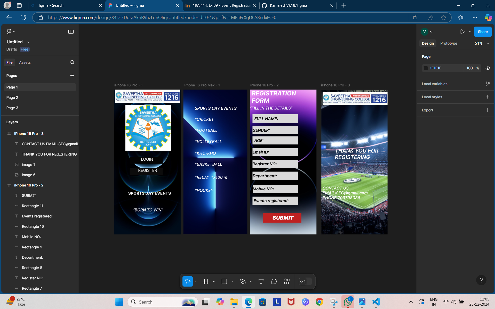

# Ex09 Event Registration Web Application
## Date:23/12/2024

## AIM:
To design, develop and deploy a web application for event registration.

## DESIGN STEPS:

### Step 1:
Create a new frame.

### Step 2:
Select any one preset size of your choice.

### Step 3:
Select the shapes you need.

### Step 4:
Import images as needed.

### Step 5:
Create pages based on your need and link them.

### Step 6:

Validate the HTML and CSS code.

### Step 6:

Publish the website in the given URL.

## DESIGN TOOL:
Figma

## CODE:
```
HOMEPAGE(PAGE 1)
<div style="width: 402px; height: 874px; position: relative; background: linear-gradient(0deg, #E0ED09 0%, #E0ED09 100%), linear-gradient(0deg, rgba(0, 0, 0, 0.20) 0%, rgba(0, 0, 0, 0.20) 100%)">
  
  
  <div style="width: 199px; height: 41px; left: 93px; top: 406px; position: absolute; background: #030303"></div>
  <div style="width: 148px; height: 59px; left: 161px; top: 406px; position: absolute; color: white; font-size: 24px; font-family: Inter; font-weight: 400; word-wrap: break-word">LOGIN</div>
  <div style="width: 199px; height: 40px; left: 93px; top: 473px; position: absolute; background: #0C0C0C"></div>
  <div style="width: 208px; height: 45px; left: 144px; top: 473px; position: absolute; color: white; font-size: 24px; font-family: Inter; font-weight: 400; word-wrap: break-word">REGISTER</div>
  
  <div style="width: 275px; height: 35px; left: 84px; top: 611px; position: absolute; color: white; font-size: 24px; font-family: Inter; font-weight: 800; word-wrap: break-word">SPORTS DAY EVENTS</div>
  <div style="left: 113px; top: 712px; position: absolute; color: white; font-size: 24px; font-family: Inter; font-style: italic; font-weight: 600; word-wrap: break-word">“BORN TO WIN”</div>
</div>

PAGE 2
<div style="width: 386px; height: 874px; position: relative; background: white">
  
  <div style="left: 68px; top: 98px; position: absolute; color: white; font-size: 24px; font-family: Inter; font-style: italic; font-weight: 600; word-wrap: break-word">SPORTS DAY EVENTS</div>
  <div style="left: 68px; top: 165px; position: absolute; color: white; font-size: 24px; font-family: Inter; font-style: italic; font-weight: 500; word-wrap: break-word">*CRICKET</div>
  <div style="left: 68px; top: 231px; position: absolute; color: white; font-size: 24px; font-family: Inter; font-style: italic; font-weight: 500; word-wrap: break-word">*FOOTBALL</div>
  <div style="left: 68px; top: 299px; position: absolute; color: white; font-size: 24px; font-family: Inter; font-style: italic; font-weight: 500; word-wrap: break-word">*VOLLEYBALL</div>
  <div style="left: 68px; top: 370px; position: absolute; color: white; font-size: 24px; font-family: Inter; font-style: italic; font-weight: 500; word-wrap: break-word">*KHO-KHO</div>
  <div style="left: 68px; top: 436px; position: absolute; color: white; font-size: 24px; font-family: Inter; font-style: italic; font-weight: 500; word-wrap: break-word">*BASKETBALL</div>
  <div style="left: 68px; top: 515px; position: absolute; color: white; font-size: 24px; font-family: Inter; font-style: italic; font-weight: 500; word-wrap: break-word">*RELAY 4X100 m</div>
  <div style="left: 68px; top: 594px; position: absolute; color: white; font-size: 24px; font-family: Inter; font-style: italic; font-weight: 500; word-wrap: break-word">*HOCKEY</div>
</div>

PAGE 3
<div style="width: 402px; height: 874px; position: relative; background: white">
  
  <div style="left: 11px; top: 0px; position: absolute; color: white; font-size: 36px; font-family: Inter; font-style: italic; font-weight: 700; word-wrap: break-word">REGISTRATION<br/>FORM</div>
  <div style="width: 257px; height: 29px; left: 0px; top: 97px; position: absolute; color: white; font-size: 24px; font-family: Inter; font-style: italic; font-weight: 600; word-wrap: break-word">“FILL IN THE DETAILS”</div>
  <div style="width: 274px; height: 54px; left: 16px; top: 148px; position: absolute; background: #D9D9D9"></div>
  <div style="left: 27px; top: 161px; position: absolute; color: black; font-size: 24px; font-family: Inter; font-style: italic; font-weight: 600; word-wrap: break-word">FULL NAME:</div>
  <div style="width: 274px; height: 49px; left: 16px; top: 218px; position: absolute; background: #D9D9D9"></div>
  <div style="left: 16px; top: 231px; position: absolute; color: black; font-size: 24px; font-family: Inter; font-style: italic; font-weight: 600; word-wrap: break-word">GENDER:</div>
  <div style="width: 274px; height: 49px; left: 16px; top: 282px; position: absolute; background: #D9D9D9"></div>
  <div style="left: 27px; top: 293px; position: absolute; color: black; font-size: 24px; font-family: Inter; font-style: italic; font-weight: 600; word-wrap: break-word">AGE:</div>
  <div style="width: 274px; height: 49px; left: 16px; top: 353px; position: absolute; background: #D9D9D9"></div>
  <div style="left: 16px; top: 363px; position: absolute; color: black; font-size: 24px; font-family: Inter; font-style: italic; font-weight: 600; word-wrap: break-word">Email ID:</div>
  <div style="width: 274px; height: 49px; left: 16px; top: 424px; position: absolute; background: #D9D9D9"></div>
  <div style="left: 16px; top: 434px; position: absolute; color: black; font-size: 24px; font-family: Inter; font-style: italic; font-weight: 600; word-wrap: break-word">Register NO:</div>
  <div style="width: 274px; height: 49px; left: 16px; top: 495px; position: absolute; background: #D9D9D9"></div>
  <div style="left: 17px; top: 506px; position: absolute; color: black; font-size: 24px; font-family: Inter; font-style: italic; font-weight: 600; word-wrap: break-word">Department:</div>
  <div style="width: 274px; height: 49px; left: 17px; top: 575px; position: absolute; background: #D9D9D9"></div>
  <div style="left: 17px; top: 585px; position: absolute; color: black; font-size: 24px; font-family: Inter; font-style: italic; font-weight: 600; word-wrap: break-word">Mobile NO:</div>
  <div style="width: 274px; height: 49px; left: 16px; top: 646px; position: absolute; background: #D9D9D9"></div>
  <div style="left: 23px; top: 656px; position: absolute; color: black; font-size: 24px; font-family: Inter; font-style: italic; font-weight: 600; word-wrap: break-word">Events registered:</div>
  <div style="width: 230px; height: 58px; left: 81px; top: 745px; position: absolute; background: #BE2121"></div>
  <div style="left: 137px; top: 754px; position: absolute; color: white; font-size: 32px; font-family: Inter; font-style: italic; font-weight: 900; word-wrap: break-word">SUBMIT</div>
</div>
 
PAGE 4
<div style="width: 402px; height: 874px; position: relative; background: white">
  
  
  <div style="left: 84px; top: 349px; position: absolute; color: white; font-size: 32px; font-family: Inter; font-style: italic; font-weight: 600; word-wrap: break-word">THANK YOU FOR<br/>REGISTERING</div>
  <div style="left: 10px; top: 580px; position: absolute; color: white; font-size: 24px; font-family: Inter; font-style: italic; font-weight: 600; word-wrap: break-word">CONTACT US<br/>EMAIL:SEC@gmail.com<br/>PHONE:799798088</div>
</div>

```


## OUTPUT:



## RESULT:
The program to design, develop and deploy a web application for event registration is completed successfully.
